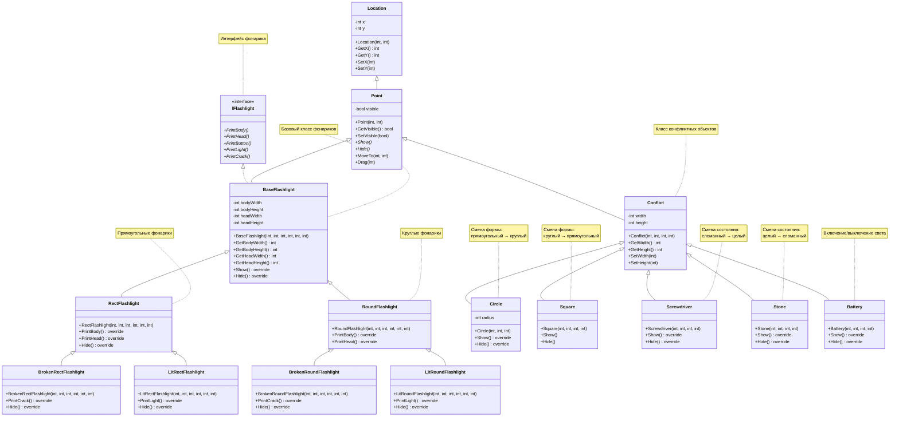

# UML Diagram - Архитектура фонарика

```mermaid
classDiagram
    %% Базовые классы
    class IFlashlight {
        <<interface>>
        +PrintBody()*
        +PrintHead()*
        +PrintButton()*
        +PrintLight()*
        +PrintCrack()*
    }

    class Location {
        -int x
        -int y
        +Location(int, int)
        +GetX() int
        +GetY() int
        +SetX(int)
        +SetY(int)
    }

    class Point {
        -bool visible
        +Point(int, int)
        +GetVisible() bool
        +SetVisible(bool)
        +Show()*
        +Hide()*
        +MoveTo(int, int)
        +Drag(int)
    }

    class Conflict {
        -int width
        -int height
        +Conflict(int, int, int, int)
        +GetWidth() int
        +GetHeight() int
        +SetWidth(int)
        +SetHeight(int)
    }

    %% Фонарики
    class BaseFlashlight {
        -int bodyWidth
        -int bodyHeight
        -int headWidth
        -int headHeight
        +BaseFlashlight(int, int, int, int, int, int)
        +GetBodyWidth() int
        +GetBodyHeight() int
        +GetHeadWidth() int
        +GetHeadHeight() int
        +Show() override
        +Hide() override
    }

    class RectFlashlight {
        +RectFlashlight(int, int, int, int, int, int)
        +PrintBody() override
        +PrintHead() override
        +Hide() override
    }

    class BrokenRectFlashlight {
        +BrokenRectFlashlight(int, int, int, int, int, int)
        +PrintCrack() override
        +Hide() override
    }

    class LitRectFlashlight {
        +LitRectFlashlight(int, int, int, int, int, int)
        +PrintLight() override
        +Hide() override
    }

    class RoundFlashlight {
        +RoundFlashlight(int, int, int, int, int, int)
        +PrintBody() override
        +PrintHead() override
    }

    class BrokenRoundFlashlight {
        +BrokenRoundFlashlight(int, int, int, int, int, int)
        +PrintCrack() override
        +Hide() override
    }

    class LitRoundFlashlight {
        +LitRoundFlashlight(int, int, int, int, int, int)
        +PrintLight() override
        +Hide() override
    }

    %% Конфликтные объекты
    class Circle {
        -int radius
        +Circle(int, int, int)
        +Show() override
        +Hide() override
    }

    class Square {
        +Square(int, int, int, int)
        +Show()
        +Hide()
    }

    class Screwdriver {
        +Screwdriver(int, int, int, int)
        +Show() override
        +Hide() override
    }

    class Stone {
        +Stone(int, int, int, int)
        +Show() override
        +Hide() override
    }

    class Battery {
        +Battery(int, int, int, int)
        +Show() override
        +Hide() override
    }

    %% Связи наследования
    Location <|-- Point
    Point <|-- Conflict
    Point <|-- BaseFlashlight
    IFlashlight <|.. BaseFlashlight
    Conflict <|-- Circle
    Conflict <|-- Square
    Conflict <|-- Screwdriver
    Conflict <|-- Stone
    Conflict <|-- Battery
    BaseFlashlight <|-- RectFlashlight
    BaseFlashlight <|-- RoundFlashlight
    RectFlashlight <|-- BrokenRectFlashlight
    RectFlashlight <|-- LitRectFlashlight
    RoundFlashlight <|-- BrokenRoundFlashlight
    RoundFlashlight <|-- LitRoundFlashlight

    %% Аннотации
    note for IFlashlight "Интерфейс фонарика"
    note for BaseFlashlight "Базовый класс фонариков"

    note for Conflict "Класс конфликтных обьектов"
    
    note for RectFlashlight "Прямоугольные фонарики"
    note for RoundFlashlight "Круглые фонарики"
    note for Circle "Смена формы: 
    прямоугольный → круглый"
    note for Square "Смена формы: 
    круглый → прямоугольный"
    note for Battery "Включение/выключение света"
    note for Screwdriver "Смена состояния: 
    сломанный → целый"
    note for Stone "Смена состояния: 
    целый → сломанный"
```