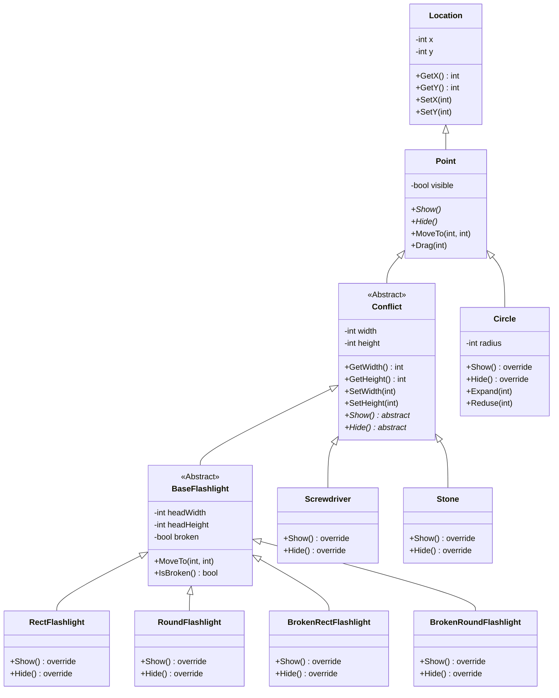

# UML Diagram - Architecture 1

## Базовая архитектура классов

```mermaid
classDiagram
    class Location {
        -int x
        -int y
        +GetX() int
        +GetY() int
        +SetX(int)
        +SetY(int)
    }

    class Point {
        -bool visible
        +Show()*
        +Hide()*
        +MoveTo(int, int)
        +Drag(int)
    }

    class Conflict {
        <<Abstract>>
        -int width
        -int height
        +GetWidth() int
        +GetHeight() int
        +SetWidth(int)
        +SetHeight(int)
        +Show()* abstract
        +Hide()* abstract
    }

    class BaseFlashlight {
        <<Abstract>>
        -int headWidth
        -int headHeight
        -bool broken
        +MoveTo(int, int)
        +IsBroken() bool
    }

    class Circle {
        -int radius
        +Show() override
        +Hide() override
        +Expand(int)
        +Reduse(int)
    }

    class RectFlashlight {
        +Show() override
        +Hide() override
    }

    class RoundFlashlight {
        +Show() override
        +Hide() override
    }

    class BrokenRectFlashlight {
        +Show() override
        +Hide() override
    }

    class BrokenRoundFlashlight {
        +Show() override
        +Hide() override
    }

    class Screwdriver {
        +Show() override
        +Hide() override
    }

    class Stone {
        +Show() override
        +Hide() override
    }

    Location <|-- Point
    Point <|-- Conflict
    Point <|-- Circle
    Conflict <|-- BaseFlashlight
    Conflict <|-- Screwdriver
    Conflict <|-- Stone
    BaseFlashlight <|-- RectFlashlight
    BaseFlashlight <|-- RoundFlashlight
    BaseFlashlight <|-- BrokenRectFlashlight
    BaseFlashlight <|-- BrokenRoundFlashlight
```
