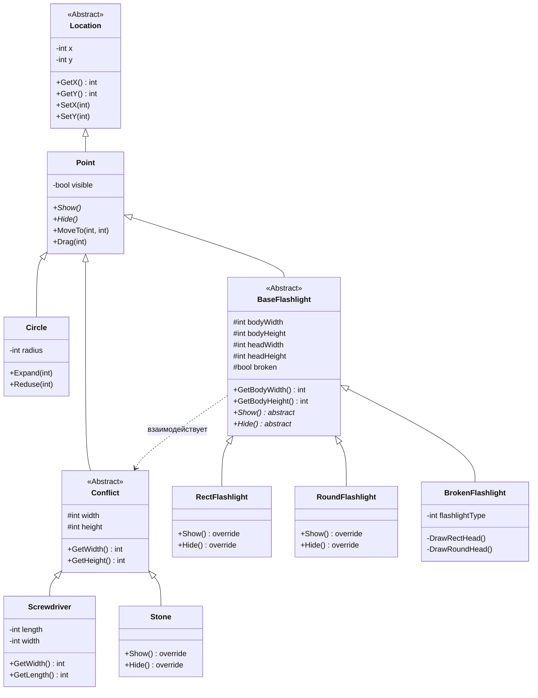

### Файл: `docs/architecture/uml_diagram_2.md`

````markdown
# UML Diagram - Architecture 2

## Улучшенная архитектура с классом Conflict


```mermaid
classDiagram
    direction TB

    %% Базовые классы
    class Location {
        <<Abstract>>
        -int x
        -int y
        +GetX() int
        +GetY() int
        +SetX(int)
        +SetY(int)
    }

    class Point {
        -bool visible
        +Show()*
        +Hide()*
        +MoveTo(int, int)
        +Drag(int)
    }

    class Conflict {
        <<Abstract>>
        #int width
        #int height
        +GetWidth() int
        +GetHeight() int
    }

    %% Специализированные классы
    class Circle {
        -int radius
        +Expand(int)
        +Reduse(int)
    }

    class BaseFlashlight {
        <<Abstract>>
        #int bodyWidth
        #int bodyHeight
        #int headWidth
        #int headHeight
        #bool broken
        +GetBodyWidth() int
        +GetBodyHeight() int
        +Show()* abstract
        +Hide()* abstract
    }

    %% Конкретные реализации
    class RectFlashlight {
        +Show() override
        +Hide() override
    }

    class RoundFlashlight {
        +Show() override
        +Hide() override
    }

    class BrokenFlashlight {
        -int flashlightType
        -DrawRectHead()
        -DrawRoundHead()
    }

    class Screwdriver {
        -int length
        -int width
        +GetWidth() int
        +GetLength() int
    }

    class Stone {
        +Show() override
        +Hide() override
    }

    %% Иерархия наследования
    Location <|-- Point
    Point <|-- Circle
    Point <|-- Conflict
    Point <|-- BaseFlashlight
    Conflict <|-- Screwdriver
    Conflict <|-- Stone
    BaseFlashlight <|-- RectFlashlight
    BaseFlashlight <|-- RoundFlashlight
    BaseFlashlight <|-- BrokenFlashlight

    %% Зависимости
    BaseFlashlight ..> Conflict : взаимодействует
```
````
