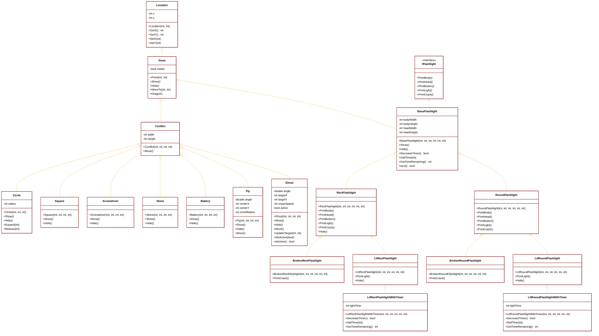

# Курсовая работа "Игровая программа 'Фонарик'"

## Краткое описание проекта

**Игровая программа "Фонарик"** представляет собой 2D-игру, разработанную на C++ с использованием WinAPI для графического отображения. Игрок управляет фонариком, который может перемещаться по экрану, сталкиваться с различными объектами и менять свои состояния. Основная цель игры — собирать батарейки для поддержания свечения фонарика, избегать столкновений с призраками (которые активируются в темноте) и ремонтировать фонарик при поломках с помощью отвертки.

### Основные особенности игры:
- **Динамическая система состояний фонарика**: 6 различных состояний (целый/сломанный/горящий × прямоугольный/круглый)
- **Разнообразные игровые объекты**: камни, отвертка, батарейки, муха, призраки
- **Физика столкновений**: система проверки коллизий между объектами
- **Автоматическое движение NPC**: муха движется по кругу, призраки преследуют игрока
- **Система освещения**: фонарик светит ограниченное время после сбора батареек
- **Респаун объектов**: батарейки появляются случайным образом, призраки возрождаются после деактивации

### Технические особенности:
- **Объектно-ориентированный дизайн**: четкая иерархия классов
- **Принципы ООП**: инкапсуляция, наследование, полиморфизм, абстракция
- **WinAPI графика**: использование GDI для отрисовки объектов с тенями и градиентами
- **Управление клавиатурой**: стрелками для перемещения, ESC для выхода

## UML-диаграмма иерархии классов

## Обоснование использования основных принципов ООП

### 1. **Инкапсуляция**
- **Сокрытие данных**: Все поля классов (`x`, `y`, `width`, `height`, `visible` и др.) объявлены как `protected` или `private`, что защищает внутреннее состояние объектов от прямого доступа извне
- **Публичный интерфейс**: Доступ к данным осуществляется через методы `GetX()`, `SetX()`, `GetVisible()` и т.д.
- **Пример**: Класс `Location` инкапсулирует координаты, предоставляя контролируемый доступ через методы-геттеры/сеттеры

### 2. **Наследование**
- **Иерархия "является"**: Четкая иерархия классов отражает отношения между объектами:
  - `Point` "является" `Location` с дополнительным свойством видимости
  - `Conflict` "является" `Point` с добавлением размеров
  - Все конкретные фонарики наследуют от `BaseFlashlight`
- **Повторное использование кода**: Базовые классы содержат общую функциональность, которую наследуют производные классы
- **Пример**: Классы `RectFlashlight` и `RoundFlashlight` наследуют общую структуру от `BaseFlashlight`, но реализуют свою уникальную отрисовку

### 3. **Полиморфизм**
- **Виртуальные методы**: Методы `Show()`, `Hide()`, `Move()` объявлены как виртуальные, что позволяет производным классам переопределять их поведение
- **Интерфейсы**: Класс `IFlashlight` определяет интерфейс для компонентов фонарика
- **Динамический полиморфизм**: В основном цикле игры объекты обрабатываются через указатели на базовые классы, но вызываются методы конкретных реализаций
- **Пример**: При вызове `currentFlashlight->Show()` вызывается соответствующая реализация в зависимости от текущего типа фонарика

### 4. **Абстракция**
- **Абстрактные классы**: `BaseFlashlight` содержит чистые виртуальные методы, делая класс абстрактным
- **Сокрытие сложности**: Детали отрисовки объектов скрыты в методах `Show()`, а игровая логика оперирует абстрактными понятиями "столкновение", "переход", "состояние"
- **Пример**: Система переходов между состояниями фонарика работает с абстрактными типами, не зная деталей реализации каждого состояния

### 5. **Принцип единственной ответственности**
- Каждый класс отвечает за одну конкретную задачу:
  - `Location` — хранение координат
  - `Point` — базовые операции с точкой
  - `Conflict` — объекты, участвующие в столкновениях
  - Конкретные классы фонариков — отрисовку конкретных типов фонариков

### 6. **Принцип расширяемости**
- Система легко расширяема: для добавления нового типа объекта достаточно создать новый класс, унаследованный от `Conflict` или `BaseFlashlight`
- Существующий код модифицировать не требуется

### 7. **Принцип разделения интерфейса**
- Интерфейс `IFlashlight` содержит только методы, относящиеся к отрисовке компонентов фонарика
- Классы, не нуждающиеся в этом интерфейсе, его не реализуют

### 8. **Принцип инверсии зависимостей**
- Высокоуровневые модули (игровая логика) зависят от абстракций (`BaseFlashlight`, `Conflict`), а не от конкретных реализаций
- Конкретные классы фонариков зависят от абстрактного `BaseFlashlight`

## Обоснование добавления фонариков с таймерами в контексте принципов ООП

### 1. **Принцип единственной ответственности**
- Классы `LitRectFlashlightWithTimer` и `LitRoundFlashlightWithTimer` отвечают только за управление временем свечения, не переопределяя базовую логику отрисовки
- `LitRectFlashlight` и `LitRoundFlashlight` остаются ответственными только за визуальное представление горящих фонариков

### 2. **Наследование**
- Новые классы наследуются от соответствующих горящих фонариков, что логично: "фонарик с таймером **является** горящим фонариком с дополнительной функциональностью"
- Переиспользуется вся визуальная логика родительских классов

### 3. **Принцип открытости/закрытости**
- Система расширена (открыта для расширения) добавлением новых классов без изменения существующего кода
- Базовые классы остаются закрытыми для модификации

### 4. **Инкапсуляция**
- Таймер свечения (`lightTime`) скрыт в защищенном поле
- Управление временем осуществляется через публичные методы `DecreaseTimer()` и `AddTime()`

### 5. **Полиморфизм**
- Переопределенные методы `DecreaseTimer()` и `GetTimeRemaining()` обеспечивают полиморфное поведение при работе с фонариками через указатели на базовый класс
- Игровая логика может работать с `BaseFlashlight*`, не зная конкретного типа фонарика

### 6. **Принцип разделения интерфейса**
- Методы управления таймером вынесены в отдельные классы, что позволяет использовать фонарики без таймера там, где это не нужно

## Влияние новых классов на архитектуру игры

Добавление классов с таймерами создает гибкую архитектуру:

1. **Иерархия состояний** теперь включает:
   - Целые фонарики (RectFlashlight, RoundFlashlight)
   - Сломанные фонарики (BrokenRectFlashlight, BrokenRoundFlashlight) 
   - Горящие фонарики (LitRectFlashlight, LitRoundFlashlight)
   - **Горящие фонарики с таймерами** (LitRectFlashlightWithTimer, LitRoundFlashlightWithTimer)

2. **Динамическое переключение состояний**: Игра может создавать нужный тип фонарика в зависимости от текущего состояния (светится/не светится, есть/нет батареи)

3. **Управление ресурсами**: Таймеры позволяют реализовать механику ограниченного времени свечения после сбора батареек

4. **Расширяемость**: При необходимости можно добавить другие типы фонариков с дополнительной функциональностью (например, мигающие, меняющие цвет и т.д.)

Таким образом, добавление классов `LitRectFlashlightWithTimer` и `LitRoundFlashlightWithTimer` демонстрирует грамотное применение принципов ООП для создания расширяемой и поддерживаемой архитектуры игровых объектов.

## Заключение

Проект демонстрирует грамотное применение принципов объектно-ориентированного программирования для создания сложной игровой системы с четкой архитектурой, легко расширяемой структурой и эффективным разделением ответственности между классами. Иерархия классов отражает реальные отношения между игровыми объектами, а использование полиморфизма позволяет создавать гибкую систему взаимодействий между ними.