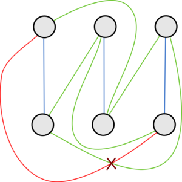
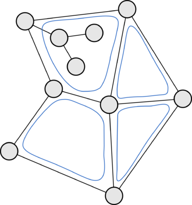

# Гамма-Алгоритм

#### Терминология
**Грань** - макс. участок поверхности ограниченный ребрами, такой, что любые две точки его могут быть соединены НЕ пересекаясь ребрами.
(**ВСЕГДА** связная - из любой точки можно дойти до любой другой!)
*Нельзя одной проходкой покрыть все точки*

**Уложенный** - можно нарисовать так, что любые два ребра не пересекаются
**Планарный** - который может быть уложен на плскть
**Плоский** - уже уложен

**Связная компонента** - группа вершин, где каждая пара соединена путём через рёбра
**Полный двудольный** - НИКОГДА не уложен


**Уложенный**




##### Обозначения:
- $G$ — исходный граф.
- $\Gamma_1, \Gamma_2$ — грани, образующиеся при укладке простого цикла на плоскость.
- $G_{\text{Plane}}$ — уложенная часть графа.
- Сегмент — компонента одного из двух типов:
  - а) Ребро, оба конца которого принадлежат $G_{\text{Plane}}$, но само оно не принадлежит $G_{\text{Plane}}$
  - б) Связная компонента $G \setminus G_{\text{Plane}}$, дополненная всеми рёбрами, у которых один конец принадлежит компоненте, а другой — $G_{\text{Plane}}$
- Контактная вершина — вершина, одновременно принадлежащая $G_{\text{Plane}}$ и сегменту.
- $G(S_i)$ — множество граней, которые могут вместить сегмент $S_i$.
- **Грань вмещает сегмент <=> когда все контактные вершины сегмента лежат на границе грани**

## Алгоритм

### Шаг 1: Инициализация
Выбирается любой простой цикл и укладывается в плоскость. При этом образуются две грани $\Gamma_1$ и $\Gamma_2$. Уложенная часть графа обозначается как $G_{\text{Plane}}$.

### Шаг 2: Построение сегментов
Рассматривается множество сегментов следующих видов:
- а) Ребро, оба конца которого принадлежат $G_{\text{Plane}}$, но само оно не принадлежит
- б) Связная компонента $G \setminus G_{\text{Plane}}$, дополненная всеми рёбрами (соединяющими эту компоненту с $G_{\text{Plane}}$), один конец принадлежит компоненте, а другой принадлежит $G_{\text{Plane}}$ 

**Поиск стаи:**
1. Начинаем с любого котика НЕ на коврике
2. Идем по дружбам к другим котикам НЕ на коврике
3. СТОП когда достигаем котика на коврике (это контактный котик)
4. ВСЕ пройденные котики = одна стая

### Шаг 3: Определение контактных вершин
Для каждого сегмента определяются контактные вершины — вершины, одновременно принадлежащие $G_{\text{Plane}}$ и данному сегменту.

### Шаг 4: Вычисление допустимых граней
Для каждого сегмента $S_i$ вычисляется множество граней $G(S_i)$, которые могут вместить данный сегмент. 

*Грань **вмещает** сегмент, если все контактные вершины сегмента принадлежат этой грани.*

| Тип цепи | Новые комнаты | Эффект |
|----------|---------------|---------|
| Между несоседними вершинами | +1 | Разрезаем комнату |
| Между соседними вершинами | +0 | Добавляем выступ |
| Замыкается в одну вершину | +0 | Создаем карман |


### Шаг 5: Проверка планарности
Если существует сегмент $S_i$, для которого $G(S_i) = \emptyset$ (т.е. сегмент нельзя уложить ни в одну грань), то граф не является планарным. Алгоритм завершается с результатом "граф не планарен".

### Шаг 6: Выбор сегмента для укладки
Выбирается сегмент $S_{\min}$ с минимальным количеством доступных граней:
$$S_{\min} = \arg\min_{S_i} |G(S_i)|$$

### Шаг 7: Укладка сегмента
- В выбранном сегменте $S_{\min}$ находится любая цепь между контактными вершинами.
- Эта цепь укладывается внутрь любой из доступных граней из $G(S_{\min})$.
- При укладке выбранная грань разбивается на две новые грани.
- Выбранный сегмент либо исчезает, либо распадается на несколько меньших сегментов.

### Шаг 8: Итерация
Шаги 2-7 повторяются до тех пор, пока:
- либо весь граф не будет уложен на плоскость (граф планарен),
- либо не будет установлено, что граф не является планарным.


**Котиковая философия:** "Не пытайся уложить всех котиков сразу - сначала создай удобные комнаты!" 🐱

## Структуры данных

#### std::map
Структура данных в виде бинарного дерева с узлами - ```{ключ, значение}```
Ключи всегда отсортированы. 

#### std::unordered_map
**Хеш-таблица**. Структура данных в виде бинарного дерева, с узлами - ```{ключ, значение}```. С бакетами. Каждый бакет - кусок исходных узлов с одинаковым хешем (там список для совпавших хешем для отсутствия конфликтов (Не существует идеаьной хеш-функции)). Бакет распределяет по хешам данные. 
Доступ по хешу ключа - 
```
Ключ -> Хеш -> Бакет -> Элемент (значение)
```

#### std::set
Структура данных в виде бинарного дерева, каждый узел - {ключ}

#### Применение
**set** — для множеств, **map** — для ассоциативных массивов.

---

## Пояснения к коду

### Проверка планарности

1. В коде ```LayingGraph::isLaying()``` присутствует такой участок с заполнением std::set уложенными ребрами:
```cpp
for (int i = 0; i < first_cycle.size(); i++) {
    int u = first_cycle[i];
    int v = first_cycle[(i + 1) % first_cycle.size()]
    laying_edges.insert({min(u, v), max(u, v)});
}
```

-  ```cpp
    laying_edges.insert({min(u, v), max(u, v)});

 Проблема в том, что set сравнивает пары элементов как ```{u, v} ≠ {v, u}```. Для этого разворачиваем ребра при вставке, => все уникальны, и нет дубликатов. Set автоматически отсортирует и удалит повторы.

- ```cpp
    int v = first_cycle[(i + 1) % first_cycle.size()]

Цикл в графе **замкнутый**: последняя вершина должна соединяться с первой (например, в цикле [A, B, C] рёбра: A-B, B-C, C-A). Без % мы пропускаем последнее ребро и не закроем цикл.

**Например:**
- Для i=0: v = cycle[1]
- Для i=1: v = cycle[2]
- Для i=2 (size=3): (2+1)%3 = 3%3 = 0 → v = cycle[0] (первая вершина).

---

### Разрезание грани

#### Шаговый разбор с примером

1. **Инициализация и проверки**:
   - `face_id = 0`, `path = {1, 5, 6, 2}`.
   - `face = faces[0] = {0, 1, 2, 3, 4}`.
   - `start = path[0] = 1`, `end = path[3] = 2`.
   - `start_it = find(face.begin(), face.end(), 1)` → итератор на элемент `1` (индекс 1 в `face`).
   - `end_it = find(face.begin(), face.end(), 2)` → итератор на элемент `2` (индекс 2 в `face`).
   - Оба найдены, так что продолжаем.
   - `start_before_end = (start_it < end_it)` → `true` (индекс 1 < индекс 2), так что идём в ветку `if (start_before_end)`.

2. **Построение `new_face1`** (сегмент от start до end + reverse внутреннего пути):
   - `new_face1.insert(new_face1.end(), start_it, end_it + 1)`:
     - `start_it` → элемент 1, `end_it + 1` → элемент 3 (индекс 3, значение 3).
     - Вставляем диапазон: `face[1]` до `face[3]` (не включая конец диапазона? Нет: `end_it + 1` — это следующий после `end_it`, так что элементы: 1, 2, 3.
     - `new_face1` становится `{1, 2, 3}`.
   - Цикл: `for (auto it = path.rbegin() + 1; it != path.rend() - 1; ++it)`:
     - `path.rbegin()` → итератор на `2` (последний элемент).
     - `rbegin() + 1` → итератор на `6` (предпоследний).
     - `path.rend() - 1` → итератор на `5` (первый элемент пути, но с конца: rend() перед первым, rend()-1 перед `5`? Подождите: для вектора размера 4, индексы 0:1,1:5,2:6,3:2.
       - rbegin() = итератор на индекс 3 (2).
       - rbegin()+1 = итератор на индекс 2 (6).
       - rend() = итератор перед индексом 0.
       - rend()-1 = итератор на индекс 0? Нет: rend() — это end() для reverse, так что rend()-1 — это предыдущий, т.е. итератор на индекс 0 (1)? Давай уточним: для вектора {1,5,6,2}, reverse итераторы: rbegin()=2, ++ =6, ++=5, ++=1, rend().
       - Цикл от rbegin()+1 (6) до rend()-1 (т.е. до 5, не включая 1).
       - Итераторы: сначала it=6, затем ++it=5, затем ++it=1 (но цикл до rend()-1, т.е. до 5).
       - Так что цикл по {6, 5}.
     - Для каждого: `if (find(face.begin(), face.end(), *it) == face.end())` — проверка, есть ли вершина в `face` ({0,1,2,3,4}).
       - Для 6: не найдено → `new_face1.push_back(6)` → `new_face1 = {1, 2, 3, 6}`.
       - Для 5: не найдено → `new_face1.push_back(5)` → `new_face1 = {1, 2, 3, 6, 5}`.
   - Итог: `new_face1 = {1, 2, 3, 6, 5}` (сегмент грани от 1 до 3 + reverse внутреннего пути: 6, затем 5).

3. **Построение `new_face2`** (сегмент от end до start + прямой внутренний путь):
   - `new_face2.insert(new_face2.end(), end_it, face.end())`:
     - `end_it` → элемент 2, `face.end()` → конец.
     - Вставляем: `face[2]` до конца: {2, 3, 4}.
     - `new_face2 = {2, 3, 4}`.
   - `new_face2.insert(new_face2.end(), face.begin(), start_it + 1)`:
     - `face.begin()` → 0, `start_it + 1` → элемент 2 (индекс 2, значение 2).
     - Вставляем: от начала до `start_it + 1`: {0, 1, 2}? Нет: start_it=1 (элемент 1), start_it+1= элемент 2.
     - Диапазон: face.begin() to start_it+1: индексы 0 и 1: {0, 1}.
     - `new_face2 = {2, 3, 4, 0, 1}` (теперь это сегмент от 2 обратно к 1 через 4 и 0).
   - Цикл: `for (auto it = path.begin() + 1; it != path.end() - 1; ++it)`:
     - `path.begin() + 1` → итератор на `5`, `path.end() - 1` → итератор на `6` (end() перед последним? path.end() = после 2, end()-1 = итератор на 6).
     - Цикл от begin()+1 (5) до end()-1 (6), т.е. {5, 6}.
     - Для каждого: проверка `find(face, *it)`:
       - Для 5: не найдено → `push_back(5)` → `new_face2 = {2, 3, 4, 0, 1, 5}`.
       - Для 6: не найдено → `push_back(6)` → `new_face2 = {2, 3, 4, 0, 1, 5, 6}`.
   - Итог: `new_face2 = {2, 3, 4, 0, 1, 5, 6}` (сегмент грани от 2 к 1 + прямой внутренний путь: 5, затем 6).

4. **Замена грани**:
   - `new_face1` и `new_face2` не пустые.
   - `faces.erase(faces.begin() + 0)` → удаляем старую грань `{0, 1, 2, 3, 4}`.
   - `faces.push_back({1, 2, 3, 6, 5})` → добавляем первую новую грань.
   - `faces.push_back({2, 3, 4, 0, 1, 5, 6})` → добавляем вторую новую грань.
   - Итоговый `faces`: `[{1, 2, 3, 6, 5}, {2, 3, 4, 0, 1, 5, 6}]`.

#### Что произошло?
- Старая грань `{0, 1, 2, 3, 4}` была "разрезана" по пути `{1, 5, 6, 2}`: мы добавили новые вершины 5 и 6 внутрь грани и разделили её на две части.
- `new_face1` — одна часть: от 1 до 3 (включая) + новые вершины 6 и 5 (в reverse порядке, чтобы сохранить ориентацию).
- `new_face2` — другая часть: от 2 до 1 (через 4 и 0) + новые вершины 5 и 6 (в прямом порядке).
- В планарных графах это может соответствовать добавлению ребра между 1 и 2 через 5 и 6, что разделяет грань на две меньшие.

Если вершины пути уже были на границе, они бы не добавлялись (из-за проверки `find`). Если `start` был после `end` в цикле, код пошёл бы в `else` ветку (симметрично, но с перестановкой сегментов и направлений циклов).


---

### Поиск связных компонент

1. **Инициализация**:
   - `components` — пустой вектор (сюда будут добавляться найденные компоненты).
   - `visited` — пустое множество (отслеживает посещённые вершины, чтобы не обрабатывать их повторно).
   - Цикл по всем вершинам из `vertices`: `for (int v : vertices)`.

2. **Обработка вершины 0** (v=0):
   - Проверяем: `visited.find(0) == visited.end()` → Да (0 не посещена).
   - Запускаем BFS для новой компоненты:
     - `component` — пустое множество для текущей компоненты.
     - `q` — очередь, добавляем 0: `q.push(0)`.
     - `visited.insert(0)` → Теперь `visited = {0}`.
   - **BFS-цикл** (`while (!q.empty())`):
     - Извлекаем `u = 0` из очереди (`q.pop()`). `component.insert(0)` → `component = {0}`.
     - Ищем соседей `u=0`: Цикл `for (int w = 0; w < n; w++)`:
       - `w=1`: `graph[0][1] == true`, `vertices.find(1) != end` (1 в `vertices`), `visited.find(1) == end` (1 не посещена) → Добавляем `visited.insert(1)`, `q.push(1)`.
       - `w=2`: `graph[0][2] == false` → Пропускаем.
       - Остальные `w` не соседи.
     - Очередь теперь: `q = [1]`.
   - Продолжаем BFS:
     - Извлекаем `u=1`. `component.insert(1)` → `component = {0,1}`.
     - Соседи `u=1`:
       - `w=0`: `graph[1][0] == true`, но `visited.find(0) != end` (0 уже посещена) → Пропускаем.
       - `w=2`: `graph[1][2] == true`, 2 в `vertices` и не посещена → `visited.insert(2)`, `q.push(2)`.
       - `w=3`: `graph[1][3] == false` → Пропускаем.
     - Очередь: `q = [2]`.
   - Продолжаем:
     - Извлекаем `u=2`. `component.insert(2)` → `component = {0,1,2}`.
     - Соседи `u=2`:
       - `w=1`: Уже посещена.
       - `w=3`: `graph[2][3] == true`, 3 в `vertices` и не посещена → `visited.insert(3)`, `q.push(3)`.
     - Очередь: `q = [3]`.
   - Продолжаем:
     - Извлекаем `u=3`. `component.insert(3)` → `component = {0,1,2,3}`.
     - Соседи `u=3`:
       - `w=2`: Уже посещена.
       - Нет других рёбер.
     - Очередь пуста: BFS завершён.
   - Добавляем компоненту: `components.push_back({0,1,2,3})`. Теперь `visited = {0,1,2,3}`.

3. **Обработка вершины 1** (v=1):
   - `visited.find(1) != end` → Уже посещена, пропускаем.

4. **Обработка вершины 2** (v=2):
   - Уже посещена, пропускаем.

5. **Обработка вершины 3** (v=3):
   - Уже посещена, пропускаем.

6. **Обработка вершины 4** (v=4):
   - `visited.find(4) == end` → Не посещена.
   - Запускаем BFS для новой компоненты:
     - `component = {}`.
     - `q.push(4)`, `visited.insert(4)` → `visited = {0,1,2,3,4}`.
   - BFS-цикл:
     - Извлекаем `u=4`. `component.insert(4)` → `component = {4}`.
     - Соседи `u=4`: Нет рёбер (`graph[4][w] == false` для всех `w`), и очередь пуста.
   - Добавляем компоненту: `components.push_back({4})`.

7. **Конец**: Возвращаем `components = [{0,1,2,3}, {4}]`.


---


Если контактная вершина одна, то просто добавляем ребро от контактной вершины к любой вершине сегмента (и затем рекурсивно укладываем оставшуюся часть сегмента) без разбиения грани.

Но в текущей реализации мы не делаем такого разделения.